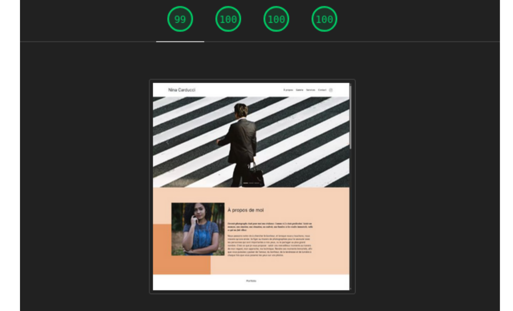

# Nina Carducci

## Description

Nina Carducci est un projet réalisé dans le cadre de la formation Développeur Intégrateur Web d'OpenClassrooms.

L'objectif consistait à optimiser un site vitrine existant afin d'améliorer ses performances, son référencement naturel (SEO), son accessibilité et son expérience utilisateur. Le travail s'est appuyé sur des audits techniques et des recommandations issues d'outils professionnels tels que Lighthouse et Wave.

## Objectifs

* Optimiser les performances du site.
* Réduire le poids des ressources.
* Améliorer le référencement naturel.
* Renforcer l'accessibilité.
* Optimiser le référencement local.
* Améliorer les scores Lighthouse.

## Technologies utilisées

* HTML5
* CSS3
* JavaScript
* Lighthouse
* Wave
* Schema.org
* Open Graph
* Twitter Cards
* Google Search Console
* WebP
* AVIF

## Fonctionnalités

* Optimisation des images
* Conversion WebP et AVIF
* Chargement optimisé des scripts
* Données structurées Schema.org
* Référencement local
* Balises Open Graph
* Twitter Cards
* Accessibilité WCAG
* Structure HTML sémantique
* Compatibilité lecteurs d'écran

## Compétences développées

* SEO technique
* Audit Lighthouse
* Audit d'accessibilité
* Optimisation des performances
* Core Web Vitals
* Référencement local
* Données structurées
* Accessibilité web
* Optimisation des médias
* Analyse et correction de problèmes UX

## Aperçu

Site vitrine optimisé pour le référencement naturel, les performances et l'accessibilité, avec amélioration des scores Lighthouse, optimisation des médias et intégration de données structurées.

## Lancer le projet

1. Cloner le dépôt.
2. Ouvrir le fichier `index.html` dans un navigateur.
3. Exécuter un audit Lighthouse pour comparer les performances obtenues.

## Auteur

Projet réalisé dans le cadre de la formation OpenClassrooms - Développeur Intégrateur Web.
